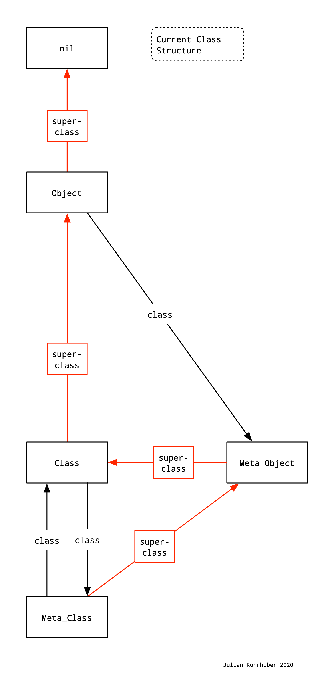

- Title: Abstract Object
- Date proposed: 2020-12-19
- RFC PR: https://github.com/supercollider/rfcs/pull/0000 **update this number after RFC PR has been filed**

# Summary

An object superclass with minimal interface is added which opens a number of new features for sclang. This requires a small, but significant change of the class kernel, adding a class  `AbstractObject` as a superclass of  `Object`.

# Motivation

This suggested change makes the class library both more dynamic and flexible.
Since many years, this has been part of the Ruby programming language, whose class stucture sclang is partly modeled after.

Because of its minimal interface, we can use it as a superclass for a broad variety of classes:

- **Delegators** that receive method calls and forward them to an internal object.
-- add instance variables to any object at runtime (e.g. a dictionary that holds metadata)
-- override methods at runtime (e.g. a logger that records all methods that were called).
-- reinterpret standard operations (e.g. a lift operator that lets us call methods on all objects in a collection at once).
-- simple and safe dependency mechanisms (no need for a central repository of dependants in the object class)
- **Prototype objects** whose methods are entries in a dictionary
-- fully integrate and are equivalent to any other object (any method can be defined dynamically, not only new names)
-- current prototype objects using dictionaries are unsafe (a class extension to any class above Dictionary may break code)
- **Algebraic objects** and other features
-- lazy objects that construct an AST instead of immediately executing the received calls.
-- method calls where each argument is informed that it will be passed to a given object
-- pluggable type systems, with a type signature for any method.

## It solves some existing problems
- reduces namespace pollution
- solves the problem of combinatory explosion for combined features
- solves the tendency for premature optimization (using classes and methods instead of functions), due to the lack of fully integrated prototype objects

## Method forwarding
Imagine a wrapper object which by default forwards calls to its internal object. If such a call forwarding is very cheap,  a wrapper can be widely used in place of the  object it holds. This has several consequences, for example this makes it often unnecessary to modify the class library. Also, depending on how cheap the call forwarding is, several layers of wrappers can be added on to add functionality.

# Preliminary work
An experimental implementation of a wide range of possible subclasses is to be found in the 'Neutral' Quark. It writes a class extansion file that overrides all methods that are not necessary. See: https://github.com/telephon/Neutral

Ruby has set an example with its class `BasicObject`
https://ruby-doc.org/core-2.7.2/BasicObject.html

# Specification

`AbstractObject` is a new class that is the superclass of  `Object`. It implements a minimal subset of the current `Object`  interface. By default, any class will still be subclass of Object unless  specified. The superclass of the class of this class `Meta_AbstractObject` is `Class`, just like in `Object`.

Theoretically, one may also want to make the class `Meta_Object`  subclass `Meta_AbstractObject`. This is possible, but not necessary, because the number of class methods and class variables is very small.

## Optimisations

An optional, but desirable optimization is a primitive that forwards a method to another object (see comment under Motivation)

For a fully transparent integration in sclang, the implementation of the `if` operator would have to handle a fallback: https://github.com/supercollider/supercollider/issues/3567

This RFC is independent of these two optimisations.

# Drawbacks

The additional class needs to be explained and understood. Currently, I can see no technical drawbacks.

Regarding delegator subclasses, it is not clear how to make forwarded keyword arguments work.

# Unresolved Questions

1. One question to be answered is whether this implementation has unintended consequences or complications in the backend, since it assumes `Object` to be the top end of the class hierarchy.

2. It should be carefully discussed which methods from  `Object`  should be kept in `AbstractObject`. Some of this is a trade-off between fluent integration and flexibility. For example, introspection methods are expected to work also in subclasses of abstract object, but each of these method are fixed and their names are not available for delegation. For example, should `.isNil`  return the nil-ness of the internal object or just false? Should `.class` return the class of the internal object?

An example of what problems one can have in making an existing class, such as a database, compatible with the use of such delegators is here https://bugs.ruby-lang.org/attachments/7943

In general, introspection and bookkeeping methods should be kept. They can still be overridden in subclasses if necessary and possible. Some of these methods (e.g. gcDumpGrey) are necessary for the system to work, they need to be kept to avoid larger modifications of the backend

There are boundary cases, for which we should find a general reasoning: e.g.  `isKindOf` or `deepCopy`.

# Alternatives

There may be an alternative to adding a primitive for erasing (possibly multiple) entries in the method table. Then, any class could erase all methods that are not needed. It is unclear if this is a realistic option in the current method table design.
